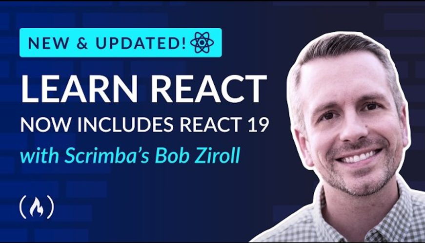

## React Course - Beginner's Tutorial for React JavaScript Library

This project is based on the [course provided by freeCodeCamp and taught by Bob Ziroll.](https://www.youtube.com/watch?v=x4rFhThSX04)

[It is also available with interactive exercises in Scrimba.](https://scrimba.com/learn-react-c0e)

All the files developed along are stored [here](https://github.com/rebecaaras/fcc-typescript-course).

⭐️ Course Contents ⭐️
- 1 Static Pages
- 2 Data-Driven React
- 3 React State
- 4 Side Effects
- 5 Capstone Project #1 - Tenzies
- 6 Capstone Project #2 - Endgame

